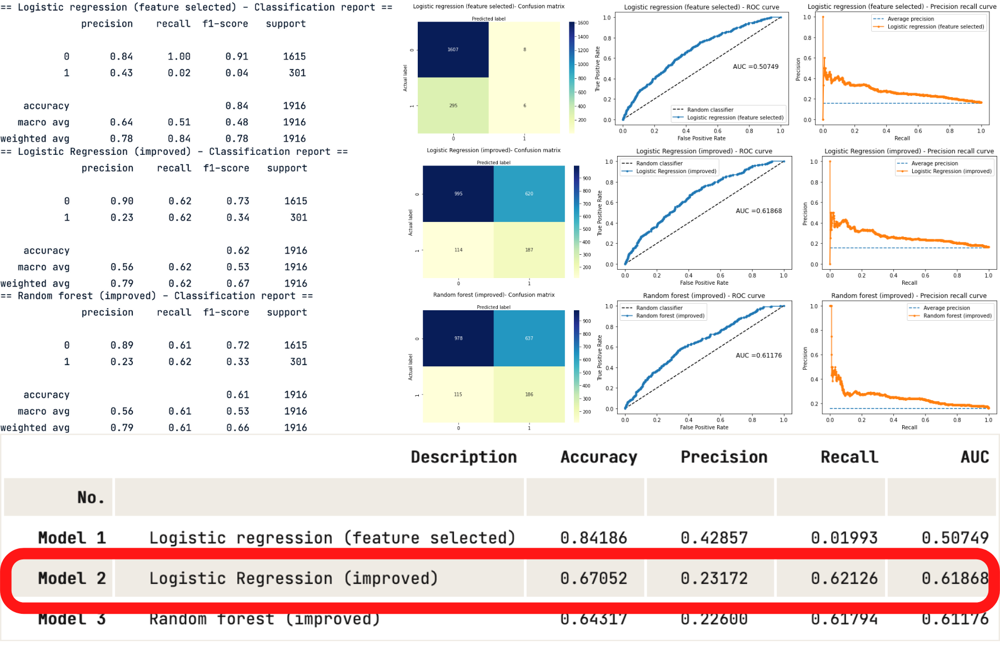

# Credit Default Model

## Results

### References

1. McKinsey, 2021, The coming opportunity in consumer lending. Available from: https://www.mckinsey.com/business-functions/risk-and-resilience/our-insights/the-coming-opportunity-in-consumer-lending 

2. BCG, 2018, Digital lending. Available from: https://image-src.bcg.com/Images/BCG-Digital-Lending-Report_tcm9-197622.pdf 

3. James, G., Witten, D., Hastie, T. and Tibshirani, R. (2013). An Introduction to Statistical Learning. New York: Springer. 

4. IBM (2020), Random Forest. Available from: https://www.ibm.com/cloud/learn/random-forest 

5. Jason Brownlee (2020), How to Fix k-Fold Cross-Validation for Imbalanced Classification. Available from: https://machinelearningmastery.com/cross-validation-for-imbalanced-classification/

6. Damien martin (2019), How to do cross-validation when up-sampling data. Available from: https://kiwidamien.github.io/how-to-do-cross-validation-when-upsampling-data.html

7. Data camp (2018), Diving deep with imbalanced data. Available from: https://www.datacamp.com/community/tutorials/diving-deep-imbalanced-data

8. Nitesh (2002), SMOTE: Synthetic Minority Over-sampling Technique. Available from https://arxiv.org/abs/1106.1813 
